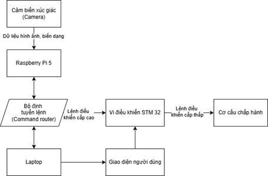

# System Architecture

## Connections
- Raspberry Pi 5 ↔ STM32 Gripper: **USB CDC** (115200 baud)
- Raspberry Pi 5 ↔ Laptop GUI: **TCP Socket** (port 5000)
- Laptop GUI ↔ STM32 Gantry: **USB Serial** (921600 baud)

## Data Flow
1. Camera → Marker tracking → Features
2. Features → MLP → Force prediction
3. Command Router (FSM on Pi) → decide action
4. Send gripper command via USB CDC
5. Send status via TCP to GUI
6. GUI send motion command via Serial to gantry

## Diagram
