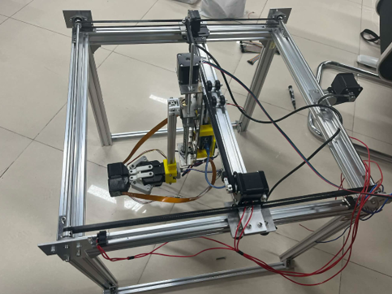

# Vision-based Tactile sensor Gripper

**Graduation Project 2026 – Hanoi University of Science and Technology**  
**Nguyễn Thượng Thanh Tùng** (tthanhtung1140003)  
Advisor: PhD. Lý Hoàng Hiệp 

<p align="center">
  
</p>

A complete **vision-based tactile gripper** with real-time slip detection and adaptive force control.  
Uses Raspberry Pi 5 for vision + MLP, STM32 for low-level control, and a custom 3-axis gantry CNC.

## ✨ Key Features
- Real-time marker tracking & slip detection (OpenCV)
- Force estimation Fx/Fy/Fz using PyTorch MLP
- 4-mode Finite State Machine: GRASPING / HOLD / HANDOVER / TRACKING
- Adaptive grip force (92% success after slip)
- Hybrid control: Pi (USB CDC) ↔ STM32 Gripper + Laptop (TCP + Serial) ↔ STM32 Gantry

## System Architecture
- **Raspberry Pi 5**: Vision + AI + Command Router  
- **STM32 Gripper**: USB CDC from Pi (PID + encoder)  
- **Laptop GUI**: TCP from Pi + Serial to STM32 Gantry  

detail → [docs/architecture.md](docs/architecture.md)

## Quick Start
```bash
git clone https://github.com/tthanhtung1140003/vision-guided-tactile-gripper.git
cd vision-guided-tactile-gripper

# Pi side
cd pi_vision && pip install -r requirements.txt && python main.py

# Laptop side

cd laptop_gui && pip install -r requirements.txt && python gui.py
